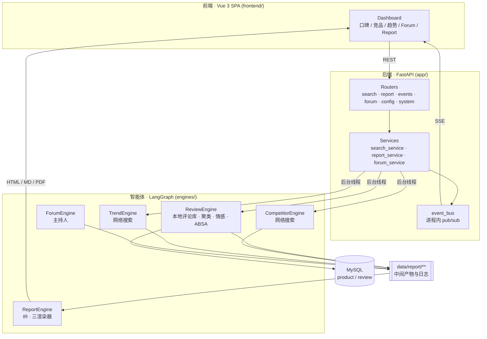

<div align="center">

# MarketLens · 尚舆

**电商商品评论与竞品分析的多智能体平台**

把 Amazon 评论数据变成一份可交付的研究报告 —— 三个分析 Agent 并行研究，主持人 Agent 交叉质询，报告 Agent 生成结构化报告（HTML / Markdown / PDF）


</div>

---

## 目录

- [这是什么](#这是什么)
- [核心特性](#核心特性)
- [系统架构](#系统架构)
- [报告生成流水线](#报告生成流水线)
- [技术栈](#技术栈)
- [快速开始](#快速开始)
- [准备数据](#准备数据)
- [使用流程](#使用流程)
- [API 一览](#api-一览)
- [目录结构](#目录结构)
- [测试](#测试)
- [配置说明](#配置说明)
- [关键设计取舍](#关键设计取舍)
- [已知问题与路线图](#已知问题与路线图)
- [第三方组件与许可](#第三方组件与许可)

---

## 这是什么

做电商选品或竞品调研时，分析者面对的是三件彼此割裂的事：

1. **几万条真实买家评论** —— 靠人读，读不完，也读不出方面级的差异（是"质量"被吐槽，还是"物流"？）
2. **竞品的公开信息** —— 散落在搜索结果的十几篇文章里
3. **市场趋势** —— 没有时间线，只有零散印象

MarketLens 把这三件事交给三个**职责单一的 Agent**，各自产出带引用的研究报告；再由一个**主持人 Agent** 组织交叉质询、暴露分歧；最后由 **ReportEngine** 把三份报告 + 讨论记录编译成一份带图表的结构化报告，输出 HTML / Markdown / PDF。

> 一句话：**从「一堆评论 + 一堆网页」到「一份有数据、有引用、有结论的报告」。**

---

## 核心特性

| 能力 | 说明 |
|---|---|
| **三引擎并行研究** | 口碑 / 竞品 / 趋势三个 Agent 同时启动，各自独立产出 Markdown 报告，互不阻塞 |
| **唯一触库的 Agent** | ReviewEngine 直连本地 MySQL 评论库（`product` / `review`），是四个引擎里唯一做数据查询的分析者 |
| **方面级情感分析（ABSA）** | 不止判断"好评/差评"，而是拆到「质量 / 价格 / 物流 / 体验 / 外观 / 服务」六个方面分别给倾向，可直接做差评归因 |
| **反思式检索循环** | 三引擎共享同一套节点流水线，每轮总结后触发反思检索，循环 `MAX_REFLECTIONS` 次再定稿 |
| **主持人讨论** | ForumEngine 主持三 Agent 的多轮讨论，日志进入最终报告的输入 |
| **报告 IR（中间表示）** | 报告不是拼字符串：章节先编译为受 JSON Schema 校验的 IR，再由渲染器消费。共 16 种块类型，含 `swotTable` / `pestTable` / `kpiGrid` / `widget` / `figure` / `callout` / `engineQuote` |
| **三渲染器** | 同一份 IR 输出 HTML（自适应排版 + 图表）、Markdown、PDF（WeasyPrint + 布局优化器） |
| **章节自愈** | 章节 JSON 校验失败时走解析修复 → 图表修复 → 换用其他 Agent 的 Key 重试的多级兜底 |
| **实时进度（SSE）** | 全局事件流 + 每任务事件流，均带事件序号与重放缓冲，断线重连不丢进度；支持协作式取消 |
| **模板与预算** | 报告生成前先做模板选择、章节切片与预算规划，避免长报告被 token 上限截断 |

---

## 系统架构



**端到端数据流**

```
download_amazon.py  →  import_amazon.py  →  MySQL (product / review)
                                              │
        ┌─────────────────────────────────────┼─────────────────────────────────────┐
        ▼                                     ▼                                     ▼
  ReviewEngine                        CompetitorEngine                       TrendEngine
  （查评论库 + ABSA）                    （网络搜索）                            （网络搜索）
        │                                     │                                     │
        └──────────────► data/report/{review,competitor,trend}/*.md ◄────────────────┘
                                              │
                                     ForumEngine → logs/forum.log
                                              │
                                       ReportEngine（IR → HTML / MD / PDF）
```

---

## 报告生成流水线

ReportEngine 是全项目最重的部分，也是"为什么它不只是个 LLM 套壳"的答案。它是一条**十节点流水线**：

```
build_context  构建上下文（读三份引擎报告 + 论坛日志 + 模板）
      ↓
normalize_reports  归一化各引擎输出，抹平格式差异
      ↓
plan_budget  规划各章节的 token 预算
      ↓
select_template  选择报告模板
      ↓
slice_template  按需裁剪模板章节（不是所有模板章节都要用）
      ↓
design_layout  决定版面与可视化块的位置
      ↓
generate_chapters  逐章生成 JSON（受 CHAPTER_JSON_SCHEMA 校验，失败走多级修复/重试）
      ↓
compose_document  合并为完整文档 IR
      ↓
render_html  渲染 HTML
      ↓
save_report  落盘 HTML / IR / state 三种产物
```

**IR 块类型一览**（定义于 `engines/ReportEngine/ir/schema.py`，是报告输出结构的唯一事实来源）：

| 类别 | 块类型 |
|---|---|
| 文本 | `heading` `paragraph` `list` `blockquote` `hr` `code` `math` `toc` |
| 数据 | `table` `swotTable` `pestTable` `kpiGrid` `widget` `figure` |
| 溯源与强调 | `engineQuote` `callout` |

行内标记支持 `bold` `italic` `strike` `code` `link` `color` `font` `highlight` `subscript` `superscript` `math`。

**产物布局**

```
data/report/
├── review/  competitor/  trend/     # 各引擎的 Markdown 报告 + state JSON
├── chapters/report_<ts>/            # 逐章中间产物
├── ir/report_ir_<topic>_<ts>.json   # 文档 IR
└── final/final_report_<topic>_<ts>.html
    final/report_state_<topic>_<ts>.json
```

---

## 技术栈

| 层 | 选型 |
|---|---|
| 后端 | FastAPI 0.121 + Uvicorn 0.37 + Pydantic 2.12 |
| Agent | LangGraph 1.0 + LangChain 生态（`langchain-openai` / `langchain-deepseek`），统一走 OpenAI 兼容客户端（`engines/common/llm_client.py`） |
| 数据库 | MySQL 8.0 / PostgreSQL，SQLAlchemy 2.0 异步引擎（`aiomysql` / `asyncpg`） |
| 情感分析 | Transformers + Torch（文档级），方面词典 + 否定词处理（ABSA） |
| 报告 | WeasyPrint 68（PDF）、自研 HTML/Markdown 渲染器、Matplotlib 图表转 SVG |
| 搜索 | Tavily / Anspire / Bocha 三选一 |
| 前端 | Vue 3 + TypeScript + Vite + Element Plus + Pinia + Vue Router |
| 实时通信 | Server-Sent Events（SSE），非 WebSocket |
| 部署 | Docker Compose（MySQL + 后端 + nginx 前端），nginx 对 SSE 关闭缓冲 |

---

## 快速开始

### 前置要求

- Python **3.12**
- Node.js 18+（仅前端开发/构建需要）
- MySQL 8.0（或 PostgreSQL）
- 至少一个 LLM API Key（四类 Agent 可用不同厂商，见[配置说明](#配置说明)）

### 方式 A · Docker Compose（推荐）

```bash
cp .env.example .env
# 编辑 .env，至少填入一个引擎的 API Key
docker-compose up
```

编排会依次完成：等待 MySQL 健康 → 建表 → 启动后端 → 启动 nginx 前端。

| 服务 | 地址 |
|---|---|
| 前端（nginx） | http://localhost:80 |
| 后端 API / 文档 | http://localhost:5000 · http://localhost:5000/docs |
| MySQL | localhost:3306 |

### 方式 B · 本地开发

仓库内已有两个 gitignore 的虚拟环境，无需重建：`project_venv/`（主应用）、`spider_venv/`（爬虫）。

```bash
# 1) 依赖
./project_venv/bin/pip install -r requirements.txt

# 2) 配置
cp .env.example .env        # 填入 API Key；本地端口见下表

# 3) 启动后端（读取 .env 的 HOST / PORT）
./project_venv/bin/python main.py
# 或热重载
./project_venv/bin/uvicorn app.main:app --reload

# 4) 启动前端开发服务器（另开一个终端）
cd frontend && npm install && npm run dev
```

| 服务 | 地址 | 说明 |
|---|---|---|
| Vite 开发服务器 | http://localhost:5173 | 已配置 `/api` 代理 |
| 后端 | http://localhost:5001 | 与 `.env` 的 `PORT=5001` 一致 |

> ⚠️ **端口要对齐**：`frontend/vite.config.ts` 的代理目标是 `http://localhost:5001`。若你把后端 `PORT` 改成别的值，需同步修改该文件，否则前端调不到接口。

**生产模式（后端直接托管 SPA）**：先构建前端，FastAPI 会挂载 `frontend/dist/`，此时只需启动后端一个进程。

```bash
cd frontend && npm run build     # vue-tsc + vite build → frontend/dist/
cd .. && ./project_venv/bin/python main.py
```

若 `frontend/dist/` 不存在，后端会退化返回一个占位页 —— 这是设计行为，不是故障。

---

## 准备数据

ReviewEngine 是唯一读库的引擎，运行前需要先把 Amazon Reviews 2023 导入 MySQL。**其余两个引擎（竞品 / 趋势）只依赖网络搜索，可以跳过这一步。**

仓库自带的导入工具支持 `.gz` 直读与断点续传：

```bash
# 1) 下载（支持断点续传）—— 以最小的 All_Beauty 类目为例
./project_venv/bin/python tools/ecommerce/download_amazon.py \
    --url "https://mcauleylab.ucsd.edu/public_datasets/data/amazon_2023/raw/meta_categories/meta_All_Beauty.jsonl.gz" \
    --out data/amazon/meta_All_Beauty.jsonl.gz

# 只想先跑通链路，可用 --max-bytes 只取前若干字节
./project_venv/bin/python tools/ecommerce/download_amazon.py \
    --url "<同上>" --out data/amazon/meta_All_Beauty.jsonl.gz --max-bytes 2000000

# 2) 导入 MySQL（product 表幂等，review 表 append-only）
./project_venv/bin/python tools/ecommerce/import_amazon.py \
    --meta data/amazon/meta_All_Beauty.jsonl.gz \
    --reviews data/amazon/All_Beauty.jsonl.gz --limit 200000
```

表结构定义在 `tools/ecommerce/schema.py`，以 Amazon 的 `parent_asin` 为键，共 `product` / `review` 两张表。

---

## 使用流程

1. 启动后端与前端，打开界面
2. 在顶部搜索框输入分析目标（商品名 / 品类 / 竞品，例如 `wireless earbuds`）
3. 三个引擎 Tab（口碑 / 竞品 / 趋势）实时显示各自的研究进度，可分别查看带引用的报告
4. **Forum** Tab 查看三个 Agent 的讨论记录
5. 三个引擎都产出后，**Report** Tab 解锁 → 生成报告 → 预览 / 下载 HTML、Markdown、PDF

---

## API 一览

| 方法 | 路径 | 说明 |
|---|---|---|
| `GET` | `/api/system/status` | 系统状态 |
| `GET` | `/api/status` | 应用状态（前端兼容保留） |
| `GET` `POST` | `/api/config` | 读取 / 更新运行时配置（LLM Key、数据库等） |
| `POST` | `/api/search` | 启动三个引擎的并行研究 |
| `GET` | `/api/search/latest` | 取最近一次各引擎结果（用于刷新后恢复界面） |
| `GET` | `/api/events/stream` | **SSE** 全局事件流（300 条回放缓冲） |
| `GET` | `/api/forum/start` `/stop` `/log` | 主持人讨论的启动 / 停止 / 日志 |
| `POST` | `/api/report/generate` | 提交报告生成任务 |
| `GET` | `/api/report/status` | 任务状态与引擎产物就绪检查 |
| `GET` | `/api/report/templates` | 可用模板列表 |
| `GET` | `/api/report/stream/{task_id}` | **SSE** 单任务进度流 |
| `GET` | `/api/report/progress/{task_id}` | 轮询式进度 |
| `POST` | `/api/report/cancel/{task_id}` | 协作式取消 |
| `GET` | `/api/report/result/{task_id}` | 报告 HTML |
| `GET` | `/api/report/result/{task_id}/json` | 报告 IR JSON |
| `GET` | `/api/report/download/{task_id}` | 下载报告 |
| `GET` | `/api/report/export/md/{task_id}` | 导出 Markdown |
| `GET` | `/api/report/export/pdf/{task_id}` | 导出 PDF |
| `POST` | `/api/report/export/pdf-from-ir` | 由 IR 直接导出 PDF |

交互式文档：启动后访问 `/docs`（Swagger UI）。

---

## 目录结构

```
app/            FastAPI 后端（HTTP 层，约 2.1k 行，刻意保持很薄）
├── routers/    端点：system · config · forum · search · events · report
├── services/   业务逻辑，框架无关：search / report / forum / event_bus
├── schemas/    Pydantic 模型
└── utils/      retry_helper、forum_reader

engines/        LangGraph 智能体（核心产品，约 34k 行）
├── common/     共享 LLMClient（全项目唯一的 OpenAI 兼容封装）
├── ReviewEngine/      口碑 Agent —— 唯一读库
├── CompetitorEngine/  竞品 Agent —— 网络搜索
├── TrendEngine/       趋势 Agent —— 网络搜索
├── ForumEngine/       主持人 Agent
└── ReportEngine/      报告 Agent（约 24.5k 行，含 ir/ · renderers/ · visualization/）

tools/          独立工具（约 38k 行，含 vendored 的爬虫与情感模型）
├── ecommerce/  Amazon 数据下载 / 导入 + 表结构
└── SentinelSpider/  爬虫（独立虚拟环境，见 requirements-spider.txt）

frontend/       Vue 3 SPA
├── src/views/       Dashboard · 口碑 · 竞品 · 趋势 · Forum · Report
├── src/components/  布局 · 控制台 · 引擎面板 · 论坛 · 报告 · 配置
└── src/stores/      Pinia：apps · config · forum · report · search · system

tests/          pytest 测试套件（26 个文件，约 6.4k 行）
data/           运行时数据（已 gitignore）：Amazon 原始数据、报告产物
logs/           运行日志（已 gitignore）：分引擎日志、论坛日志、JSON 修复失败记录
```

**引擎统一结构** —— 三个分析引擎刻意保持同构，降低心智负担：

```
engines/<Engine>/
├── agent.py     模块级入口：run_research() / generate_report()
├── context.py   @dataclass 依赖容器：llm_client · config · tools
├── graph.py     build_<engine>_graph(ctx) → 编译后的 StateGraph
├── nodes/       每个图节点一个类，__call__(state) -> dict
├── llms/        复用 engines/common 的 LLMClient
├── tools/       该引擎专属工具
└── prompts/     提示词
```

---

## 测试

```bash
./project_venv/bin/pytest                       # 全部
./project_venv/bin/pytest -m "not integration"  # 跳过网络 / 数据库集成测试
./project_venv/bin/pytest tests/test_aspect_sentiment.py -q   # 单文件
```

当前**可稳定跑绿**的子集（实测 `354 passed, 4 skipped`）：

```bash
./project_venv/bin/pytest tests/ -q \
  --ignore=tests/test_media_engine_e2e.py \
  --ignore=tests/test_query_engine_e2e.py \
  --ignore=tests/test_crawler_spider_config.py
```

被排除的三个文件对应[已知问题](#已知问题与路线图)中已定位、待修复的缺陷（引擎改名未同步、模块同名冲突），不是随机失败。

各引擎的端到端测试（`tests/test_*_engine_e2e.py`）需要真实 LLM API Key，不属于默认运行范围。

---

## 配置说明

配置由 `pydantic-settings` 管理，从仓库根目录的 `.env` 加载（路径固定，与运行时 cwd 无关）。**每个 Agent 拥有独立的 API Key / Base URL / 模型三元组**，因此可以让不同 Agent 用不同厂商的模型：

| Agent | 变量前缀 | 建议模型 |
|---|---|---|
| 口碑 Agent | `REVIEW_ENGINE_*` | `kimi-k2-0711-preview`（Moonshot） |
| 竞品 Agent | `COMPETITOR_ENGINE_*` | `gemini-2.5-pro` |
| 趋势 Agent | `TREND_ENGINE_*` | `deepseek-chat` |
| 报告 Agent | `REPORT_ENGINE_*` | `gemini-2.5-pro` |
| 主持人 | `FORUM_HOST_*` | `qwen-plus` |
| SQL 关键词优化 | `KEYWORD_OPTIMIZER_*` | `qwen-plus` |

搜索工具通过 `SEARCH_TOOL_TYPE` 在三家之间切换：`TavilyAPI` / `AnspireAPI` / `BochaAPI`。

`POST /api/config` 支持**运行时热更新**，无需重启进程。

> ⚠️ `DB_DIALECT` 的字段默认值是 `postgresql`，但 docker-compose、`tools/ecommerce/schema.py` 与导入脚本均假定 **MySQL**。请在 `.env` 中显式设置 `DB_DIALECT=mysql`。

---

## 关键设计取舍

这一节记录几个"为什么不那样做"的决定。

**1. 为什么引入报告 IR，而不是让 LLM 直接输出 HTML？**
LLM 直接吐 HTML 无法校验、无法多端复用、样式与内容耦合。改成「LLM 只产出受 JSON Schema 约束的章节 IR」后：结构错误可以在生成阶段就被 `CHAPTER_JSON_SCHEMA` 拦下并修复；同一份 IR 能同时渲染 HTML / Markdown / PDF，三种输出不会不一致。
**代价**：多了一层编译，且 IR 的块类型必须手工维护（`ir/schema.py` 是唯一事实来源，任何输出结构改动都要同步到这里）。

**2. 为什么三个分析引擎共用同一套十节点流水线？**
`generate_structure → initial_search → initial_summary → reflection_search → reflection_summary（循环）→ format_report → save_report`。三个引擎的差异只在「工具」和「提示词」，控制流完全一致。同构让新增一个分析维度只需实现工具与提示词，也让 SSE 进度事件可以统一抽象。
**代价**：当某个引擎需要真正的异形流程（例如 ReviewEngine 的聚类与 ABSA 后处理），只能挂在流水线的钩子上，而不是重新设计图。

**3. 为什么用 SSE 而不是 WebSocket？**
本场景是**服务端单向推送**进度，客户端不需要长连接会话。SSE 的收益：原生带事件 ID 与自动重连语义、纯 HTTP 因此 nginx 只需 `proxy_buffering off` 即可、调试时 `curl` 就能看。为此实现了事件序号 + 重放缓冲区，让断线重连不丢事件。
**代价**：明确约束**单进程**——`event_bus` 与任务注册表都在进程内存里，因此不能加 `--workers`。这是被写下来的约束，不是被忽略的隐患。

**4. 为什么 ForumEngine 是"主持人"而不是让 Agent 自由讨论？**
自由讨论在 LLM 上极易发散且成本不可控。加一个主持人角色负责点名、限轮次、总结收敛，能让讨论有明确终态，且日志结构稳定、可被 ReportEngine 直接引用。
**代价**：讨论的"涌现性"被削弱，更接近受控的多方质询。

**5. 为什么按 Agent 拆分 LLM 配置？**
不同子任务对模型的要求不同：SQL 关键词优化和论坛主持适合便宜快的小模型，报告章节生成需要最强模型。拆开配置可以直接把成本花在刀刃上。
**代价**：`.env` 的变量数量变多（6 组三元组）。

**6. 为什么 `app/` 层刻意保持很薄？**
路由只做参数校验与转发，业务逻辑都在 `services/`，且 services 尽量不依赖 FastAPI 类型。这样引擎可以被脚本、测试或未来的任务队列直接调用，而不必绕过 HTTP 层。

---

## 已知问题与路线图

本仓库附带一份**基于实测**的改进清单：[`IMPROVEMENTS.md`](IMPROVEMENTS.md)。它记录了每个问题的可复现命令与文件行号，而不是泛泛而谈。当前公开的主要问题：

| 问题 | 实测表现 |
|---|---|
| 测试收集失败 | 根目录 `pytest` 有 7 个 collection error（`engines/` 未成包、包内测试文件、vendored 爬虫依赖），需 `pytest tests/` 才能运行 |
| 引擎改名未同步 | `tests/test_{media,query}_engine_e2e.py` 仍引用旧名 `MediaEngine` / `QueryEngine`，导致 12 个 error |
| 模块同名冲突 | 仓库存在三个顶层 `config`（`app/config.py`、`tools/SentinelSpider/config.py`、MediaCrawler 的 `config` 包），测试结果依赖 import 顺序 |
| 打包配置缺失 | 无 `pyproject.toml`，因此存在 6 处 `sys.path` 注入 |
| 配置热更新不完全 | 9 处 `from app.config import settings` 按值导入，`reload_settings()` 对其无效 |
| 可观测性缺失 | 无 token / 成本核算，无调用链追踪 |
| 任务状态在内存 | `ReportTask` 注册表仅保留最近 5 条，进程重启丢失进行中的长任务 |

**路线图（按优先级）**

- [ ] `pyproject.toml` + 包化，让根目录 `pytest` 0 error（同时移除全部 `sys.path` 注入）
- [ ] 同步改名两个 e2e 测试并补 `pytest.mark.integration`
- [ ] 新增 `README` 中承诺的 CI：`ruff check` + `pytest -m "not integration"`
- [ ] LLM 调用可观测性：token / 成本 / 耗时 / 重试次数落盘 + 面板
- [ ] 评测基准：固定 query 集上对比单智能体 vs 多智能体，量化收益
- [ ] 任务状态持久化 + 并发上限 + 可见的重试降级日志

---

## 第三方组件与许可

本仓库**尚未添加顶层 `LICENSE`**。请注意 `tools/` 下包含 vendored 的第三方项目，各自保留其原始许可：

- `tools/SentinelSpider/DeepSentimentCrawling/MediaCrawler/` —— 自带 `LICENSE`
- `engines/ReportEngine/renderers/assets/fonts/` —— 自带 `LICENSE.txt`（思源宋体，SIL OFL）

在将本项目用于分发或商业用途前，请先核对上述组件的许可条款。

---

<div align="center">

**MarketLens / 尚舆** · 让评论数据自己说话

</div>
